# CelebA Face Attribute Recognition and Image Processing


中文 | [English](#english)

## 中文

这是一个数字图像处理期末大作业项目。项目使用 CelebA 数据集完成人脸图像预处理、增强、分割、特征可视化，并训练一个轻量级 CNN 识别两个人脸属性：`Male` 和 `Eyeglasses`。

本项目的难度定位是课程期末作业：覆盖常见数字图像处理实验内容，代码可以本地复现，输出结果可以直接放进课程报告。不把它包装成生产级系统，也不声称达到研究级最优结果。

## 本地结果预览

### 训练曲线

| Loss curve | Validation accuracy |
| --- | --- |
| 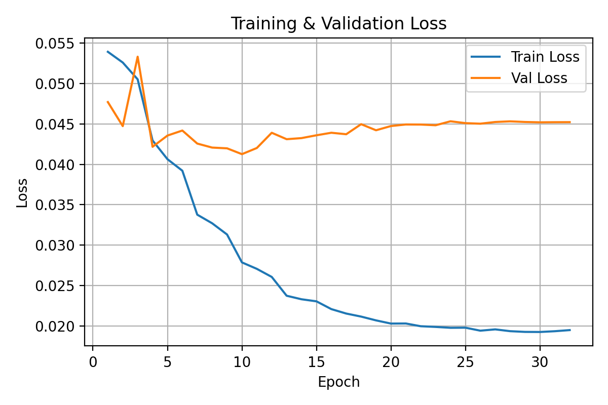 | 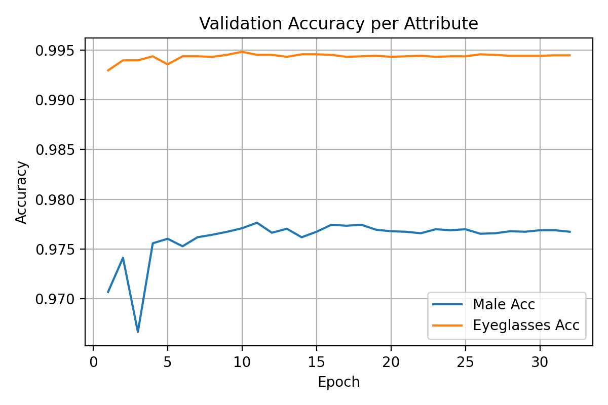 |

### 测试与可视化

| Confusion matrix | Random predictions |
| --- | --- |
| 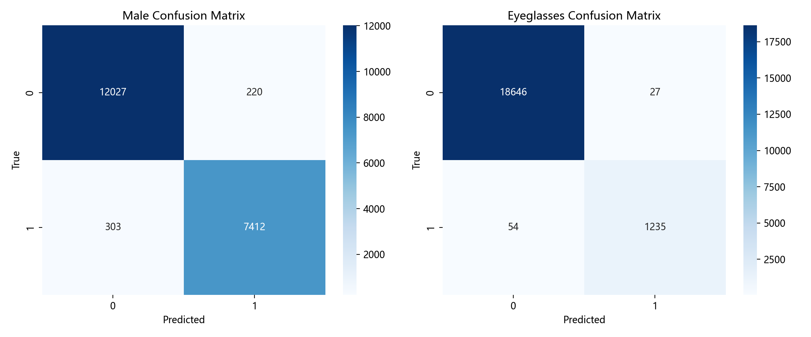 | 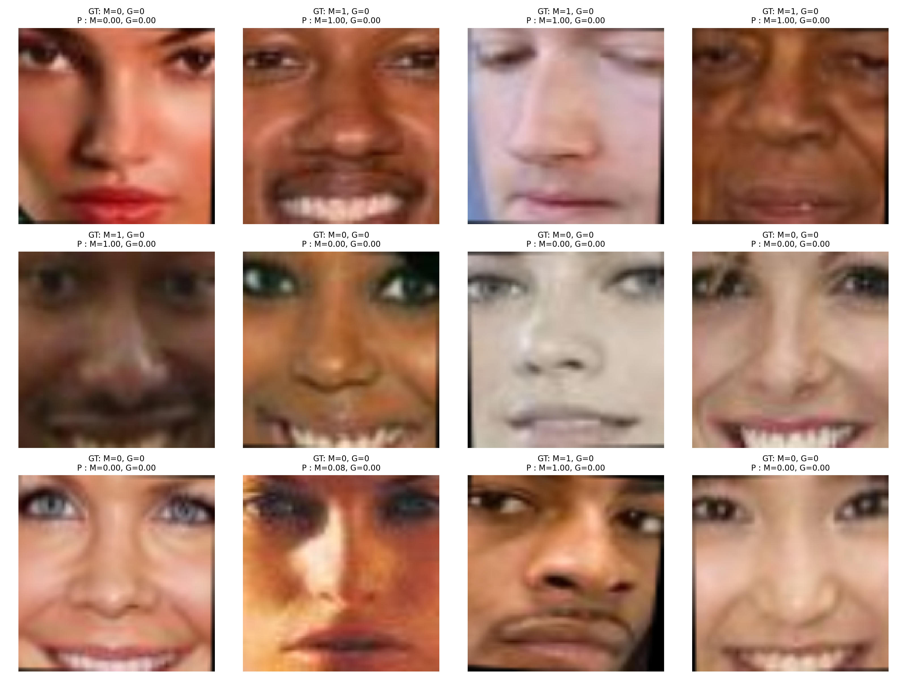 |

| Correct samples | Wrong samples |
| --- | --- |
| 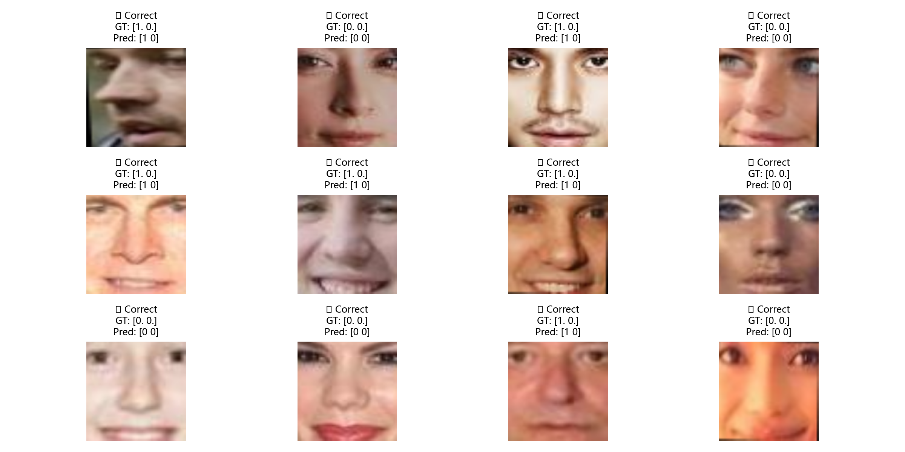 | 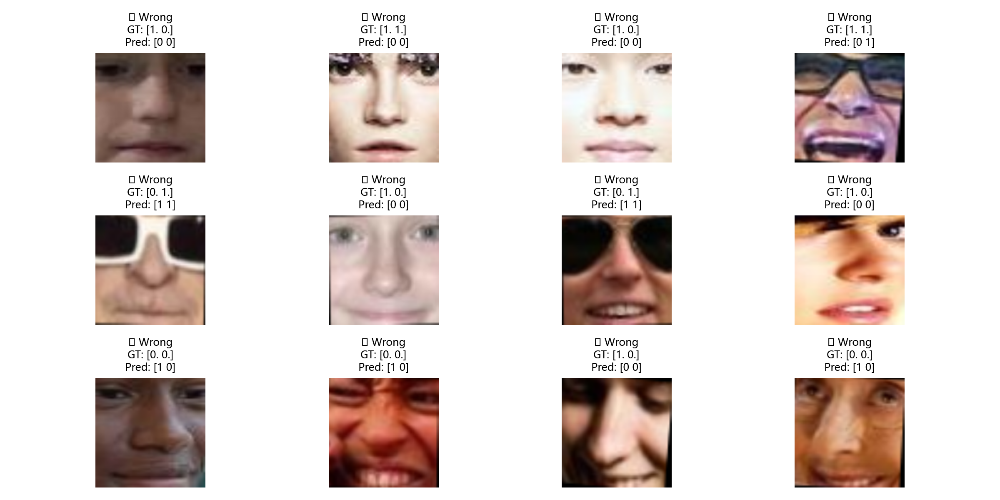 |

### 图像处理实验输出

| Step | Local output |
| --- | --- |
| Attribute distribution | 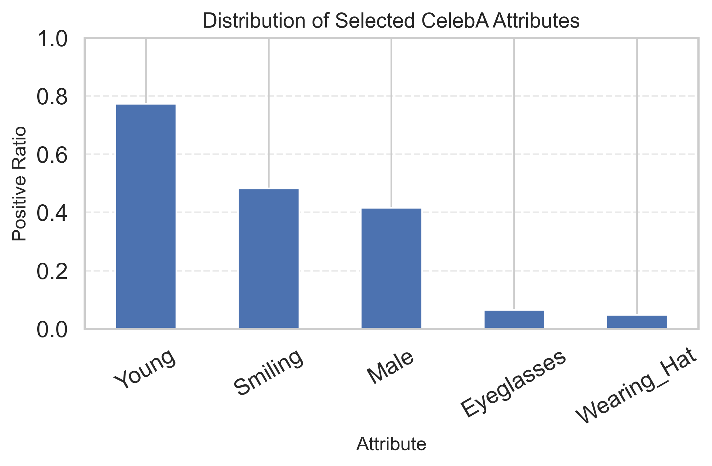 |
| Face alignment | 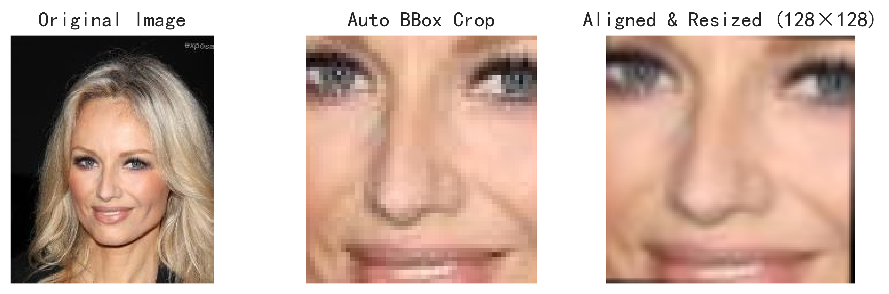 |
| Spatial filtering | 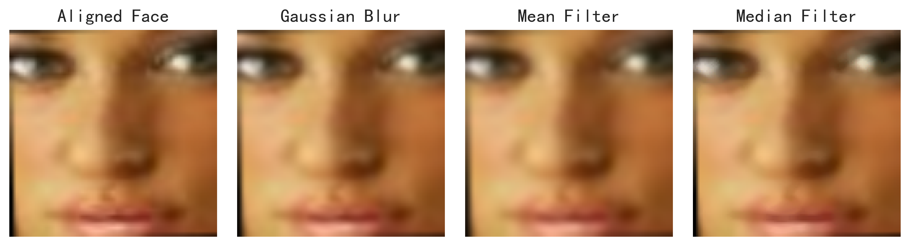 |
| Sharpening | 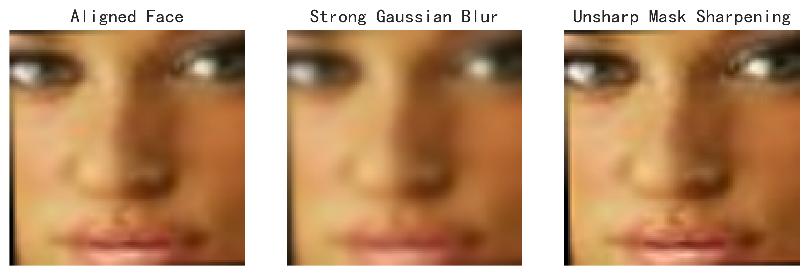 |
| Histogram equalization and CLAHE | 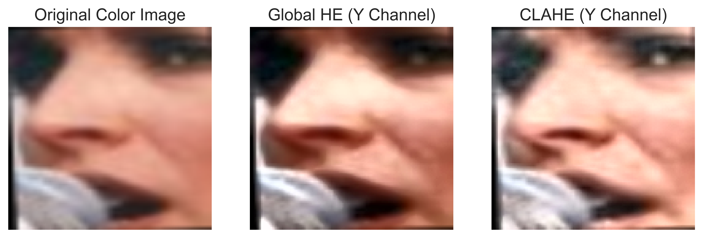 |
| Segmentation | 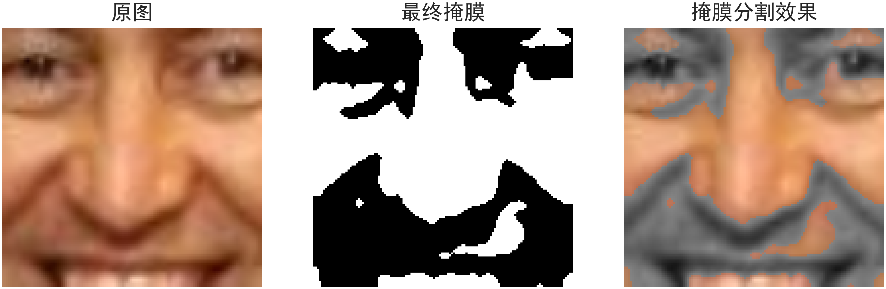 |
| Edge detection | 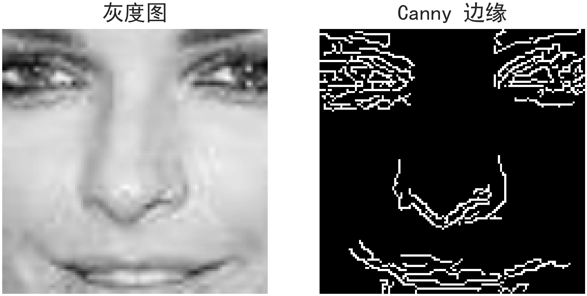 |
| HOG feature | 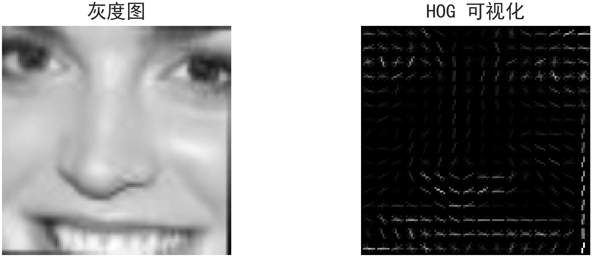 |

## 项目内容

- 读取 CelebA 的属性、边界框、五官关键点和官方划分文件
- 用五个关键点估计人脸区域，并根据双眼位置旋转对齐
- 将人脸裁剪、对齐、缩放到 `128 x 128`
- 展示灰度化、几何变换、滤波、锐化、直方图均衡、CLAHE
- 展示 Otsu 阈值分割、形态学清理、K-means 颜色分割
- 展示 Sobel、Canny、Harris、LBP、HOG 等传统特征
- 训练一个 4 层卷积块的 CNN，预测 `Male` 和 `Eyeglasses`
- 输出训练曲线、测试可视化、混淆矩阵、正确样本和错误样本

## 数据集

本地使用 CelebA 数据集，当前检测到：

| Item | Count / Size |
| --- | ---: |
| Aligned face images | 202599 images |
| Train split | 162770 images |
| Validation split | 19867 images |
| Test split | 19962 images |
| Local image folder size | 1.7 GB |
| Local model weight | 34 MB |

脚本默认读取以下路径：

```text
data/archive/img_align_celeba/
data/archive/list_attr_celeba.csv
data/archive/list_bbox_celeba.csv
data/archive/list_landmarks_align_celeba.csv
data/archive/list_eval_partition.csv
```

数据需要手动下载。远端原 `data/README.md` 给出的下载入口是：

- CelebA official page: https://mmlab.ie.cuhk.edu.hk/projects/CelebA.html
- Google Drive mirror: https://drive.google.com/drive/folders/0B7EVK8r0v71pQ-1tLS0tNkZvcFo

下载后将 CSV 标注文件和 `img_align_celeba/` 放到 `data/archive/`。四个 CSV 是代码运行必需文件，`img_align_celeba/` 保存约 20 万张人脸图片。没有这些文件时，`src/train.py`、`src/test.py` 和 `src/visible.py` 都无法完整运行。

原始数据不进入 Git 仓库。`data/` 下只允许跟踪 `README.md` 和 `.gitignore`。本仓库已经配置 `.gitignore`、`data/.gitignore`、本地 Git hooks 和 GitHub Actions 检查来拦截原始数据文件。

## 目录结构

```text
.
├── .github/workflows/          # GitHub Actions checks
├── .githooks/                  # Local Git hooks
├── archive/                    # Legacy files and old drafts
├── data/                       # Local CelebA data, ignored by Git
├── docs/                       # Course documents and report outlines
├── models/                     # Local model weights, ignored by Git
├── notebooks/
│   ├── introduction.ipynb
│   ├── all.ipynb
│   └── results/                # Notebook figures
├── results/
│   ├── training/               # Loss and accuracy curves
│   └── evaluation/             # Confusion matrix and sample predictions
├── src/
│   ├── celeba_utils.py         # Data loading and face alignment
│   ├── train.py                # CNN training
│   ├── test.py                 # Test set evaluation and random visualization
│   └── visible.py              # Reports, confusion matrix, correct/wrong samples
├── requirements.txt
└── README.md
```

## 安装

建议在虚拟环境中安装依赖：

```bash
pip install -r requirements.txt
```

当前依赖包括：

```text
numpy
pandas
opencv-python
Pillow
matplotlib
seaborn
scikit-learn
torch
torchvision
tqdm
notebook
```

## 运行

训练模型：

```bash
python src/train.py
```

`src/train.py` 当前要求 CUDA 可用。脚本会读取训练集和验证集，保存最佳权重到：

```text
models/best_model.pth
```

测试模型：

```bash
python src/test.py
```

生成分类报告、混淆矩阵、正确样本和错误样本：

```bash
python src/visible.py
```

`src/visible.py` 可以在没有 CUDA 时使用 CPU。完整测试集推理会比 GPU 慢。

## 模型说明

输入为对齐后的 `128 x 128` RGB 人脸图像。模型结构：

```text
Conv(3 -> 32)  + BatchNorm + ReLU + MaxPool
Conv(32 -> 64) + BatchNorm + ReLU + MaxPool
Conv(64 -> 128) + BatchNorm + ReLU + MaxPool
Conv(128 -> 256) + BatchNorm + ReLU + MaxPool
Flatten
Linear(256 * 8 * 8 -> 512) + ReLU + Dropout
Linear(512 -> 2)
```

训练设置：

| Setting | Value |
| --- | --- |
| Target attributes | `Male`, `Eyeglasses` |
| Loss | `BCEWithLogitsLoss` |
| Optimizer | Adam |
| Learning rate | `1e-3` |
| Weight decay | `1e-5` |
| Scheduler | StepLR, step size 3, gamma 0.5 |
| Batch size | 512 |
| Epochs | 32 |
| Input size | `128 x 128` |

## 输出文件

训练输出：

```text
results/training/loss_curve.png
results/training/acc_curve.png
```

测试输出：

```text
results/evaluation/test_visualization.png
results/evaluation/confusion_matrix.png
results/evaluation/correct_samples.png
results/evaluation/wrong_samples.png
results/evaluation/metrics_summary.csv
```

Notebook 图像处理输出：

```text
notebooks/results/
```

## 当前限制

- 训练脚本默认使用 CUDA；没有 NVIDIA GPU 时需要改设备选择和批大小。
- `requirements.txt` 没有固定版本号，不同环境可能出现 PyTorch 或 OpenCV 版本差异。
- 模型只预测 `Male` 和 `Eyeglasses` 两个属性。
- 原始 CelebA 数据和模型权重不随仓库提交，需要在本地准备。
- 当前 README 只引用本地已有输出图，不写无法从本地文件确认的测试准确率。

## 数据提交规则

禁止提交以下内容：

```text
data/archive/
data/archive/img_align_celeba/
data/archive/*.csv
models/*.pth
```

允许提交：

```text
data/README.md
data/.gitignore
results/training/*.png
results/evaluation/*.png
notebooks/results/*.png
```

---

## English

This is a final project for a Digital Image Processing course. It uses the CelebA dataset to run face preprocessing, enhancement, segmentation, feature visualization, and a lightweight CNN classifier for two facial attributes: `Male` and `Eyeglasses`.

The scope is intentionally course-level: it covers standard image processing topics, keeps the code reproducible on a local machine, and produces figures that can be used in a course report. It is not presented as a production system or a research-level benchmark.

## Local Results

### Training Curves

| Loss curve | Validation accuracy |
| --- | --- |
|  |  |

### Evaluation and Visualization

| Confusion matrix | Random predictions |
| --- | --- |
|  |  |

| Correct samples | Wrong samples |
| --- | --- |
|  |  |

## What This Project Does

- Loads CelebA attributes, bounding boxes, facial landmarks, and official split files
- Estimates the face region from five landmarks and aligns faces by eye positions
- Crops, aligns, and resizes faces to `128 x 128`
- Demonstrates grayscale conversion, geometric transforms, filtering, sharpening, histogram equalization, and CLAHE
- Demonstrates Otsu thresholding, morphological cleanup, and K-means color segmentation
- Demonstrates Sobel, Canny, Harris, LBP, and HOG features
- Trains a small CNN to classify `Male` and `Eyeglasses`
- Generates training curves, random predictions, confusion matrices, correct samples, and wrong samples

## Dataset

The local CelebA dataset contains:

| Item | Count / Size |
| --- | ---: |
| Aligned face images | 202599 images |
| Train split | 162770 images |
| Validation split | 19867 images |
| Test split | 19962 images |
| Local image folder size | 1.7 GB |
| Local model weight | 34 MB |

Expected local paths:

```text
data/archive/img_align_celeba/
data/archive/list_attr_celeba.csv
data/archive/list_bbox_celeba.csv
data/archive/list_landmarks_align_celeba.csv
data/archive/list_eval_partition.csv
```

Download CelebA manually from:

- CelebA official page: https://mmlab.ie.cuhk.edu.hk/projects/CelebA.html
- Google Drive mirror: https://drive.google.com/drive/folders/0B7EVK8r0v71pQ-1tLS0tNkZvcFo

After downloading, place the CSV annotation files and `img_align_celeba/` under `data/archive/`. The four CSV files are required by the data loader, and `img_align_celeba/` contains about 200k aligned face images. Without these local files, `src/train.py`, `src/test.py`, and `src/visible.py` cannot run end to end.

Raw data is not committed to this repository. Only `data/README.md` and `data/.gitignore` may be tracked under `data/`. The repository includes ignore rules, local Git hooks, and a GitHub Actions check to block raw data files.

## Installation

Install dependencies:

```bash
pip install -r requirements.txt
```

## Usage

Train:

```bash
python src/train.py
```

Test:

```bash
python src/test.py
```

Generate the classification report, confusion matrix, correct samples, and wrong samples:

```bash
python src/visible.py
```

## Notes

- `src/train.py` currently requires CUDA.
- `src/visible.py` can fall back to CPU, but full test inference will be slower.
- The model predicts only two attributes: `Male` and `Eyeglasses`.
- Raw CelebA files and model weights are local artifacts and should not be pushed.
- This README does not report accuracy numbers that cannot be verified from local text files.
